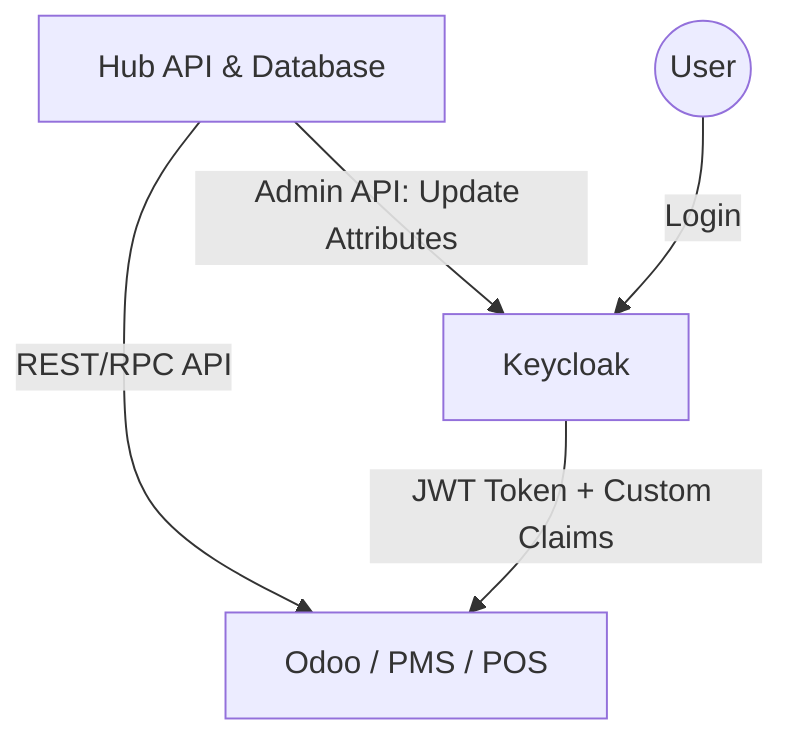

# Chiến lược Hợp nhất Danh tính và Phân quyền (KiNEX Workspace)

Tài liệu này tóm tắt giải pháp kỹ thuật để kết nối Hub, Keycloak và các ứng dụng vệ tinh (Odoo, PMS, POS) bằng phương pháp **Attribute-based Mapping**.

## 1. Kiến trúc Tổng thể
Mô hình sử dụng **Hub** làm trung tâm điều phối (Orchestrator) và **Keycloak** làm trung tâm danh tính (Identity Provider) để phát tán thông tin quyền hạn.



---

## 2. Chiến lược Mapping Người dùng (User Mapping)

### Giải pháp: **User Attributes Distribution**
1.  **Hub Database**: Lưu trữ bảng `UserAppMapping` (Prisma) để làm gốc.
2.  **Keycloak**: Lưu `externalId` của từng ứng dụng vào **User Attributes**.
    *   Ví dụ: `ext_id_odoo: 105`.
3.  **Distribution**: Sử dụng **Protocol Mappers** để đưa các attribute này vào JWT Token.
    *   Claim nhận được: `"odoo_user_id": "105"`.

---

## 3. Chiến lược Mapping Quyền hạn (Role/Group Mapping)

### Mục tiêu:
Loại bỏ việc quản lý Role thủ công trên Keycloak. Hub sẽ quyết định danh sách quyền và Keycloak chỉ đóng vai trò "vận chuyển".

### Giải pháp: **Attribute-based Roles (Simplified)**
1.  **Hub (Logic Engine)**: Hub tính toán danh sách quyền (Groups/Roles) cho từng app dựa trên Unified Role.
    *   Kết quả là một mảng các chuỗi (string array).
    *   Ví dụ: `["base.group_user", "sale.group_sales_manager"]`.
2.  **Keycloak (Carrier)**: Hub đẩy mảng này vào một User Attribute tương ứng với App đó.
    *   Attribute: `app_odoo_groups`.
3.  **Mapper (Translator)**: Cấu hình Mapper trên Keycloak để chuyển Attribute thành Claim trong Token:
    *   **Odoo Client**: Map attribute `app_odoo_groups` -> claim `groups` (Multivalued: ON).
    *   **PMS Client**: Map attribute `app_pms_roles` -> claim `roles` (Multivalued: ON).

---

## 4. Đồng bộ hóa Metadata (Discovery Approach)

Vì các ứng dụng con vẫn có controller riêng để quản lý Group/Role, Hub sẽ thực hiện cơ chế **"Quét" (Scanning)**:

1.  **Fetch**: Hub gọi API của Odoo/PMS để lấy danh sách các Group/Role hiện có.
2.  **Mapping UI**: Admin trên Hub thực hiện so khớp các Group/Role này vào Unified Role của Hub.
3.  **No-Sync to KC**: **Không cần** tạo Role tương ứng trên Keycloak. Keycloak chỉ lưu trữ chúng dưới dạng chuỗi văn bản trong Attribute.

---

## 5. Luồng Provisioning (Cấp quyền)

Khi một nhân viên được thay đổi vai trò trên Hub, hệ thống thực hiện các bước:

1.  **Hub Database**: Cập nhật Prisma.
2.  **App API**: Hub gọi API trực tiếp sang Odoo/PMS để cập nhật DB nội bộ của app đó.
3.  **Keycloak Admin API**: Hub cập nhật các thuộc tính của User:
    ```json
    {
      "attributes": {
        "app_odoo_groups": ["group_1", "group_2"],
        "app_pms_roles": ["role_admin"],
        "ext_id_odoo": ["105"]
      }
    }
    ```

---

## 6. Lợi ích của phương pháp Attribute-based
*   **Đơn giản hóa Keycloak**: Keycloak không cần quan tâm logic phân quyền, chỉ cần lưu và phát thông tin.
*   **Linh hoạt tuyệt đối**: Khi Odoo hoặc PMS thêm quyền mới, bạn chỉ cần cập nhật logic ở Hub. Không cần cấu hình lại Keycloak.
*   **Hiệu suất**: Token chứa đầy đủ thông tin cần thiết, các app con không cần gọi ngược lại Hub để kiểm tra quyền.
*   **Dễ bảo trì**: Toàn bộ "Ma trận quyền hạn" nằm tập trung tại code và database của Hub.
